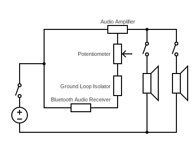
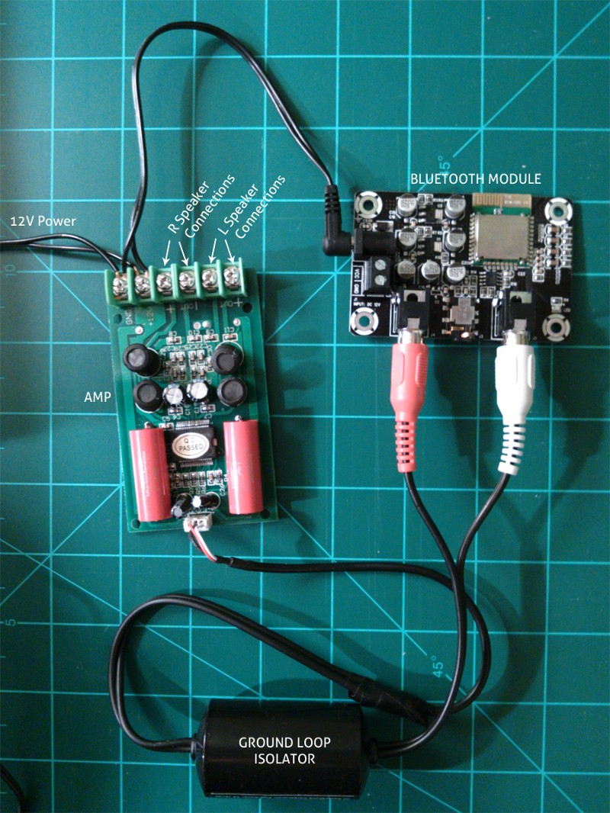
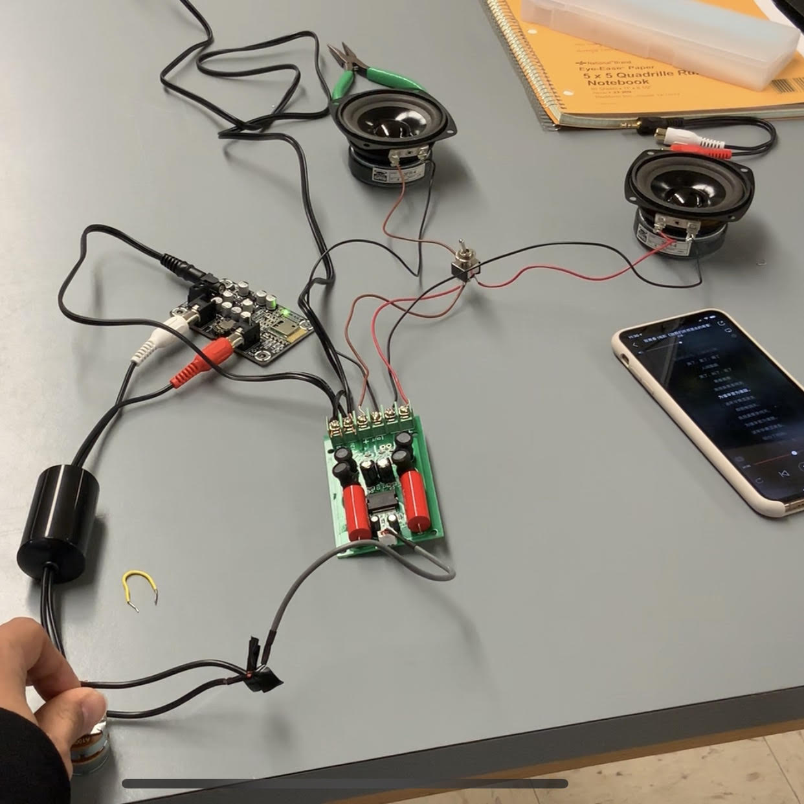

# How to make a Bluetooth Speaker
Hi. This is Max Huang from Bates College working on his final electronics project. He is making a wireless bluetooth 4.0 speaker! Why bluetooth? Come on. I know you cannot put down you phone for those seconds to plug into the wire or you don't even have a earphone plug like the new iPhones and iPads, so bluetooth 4.0 is one of your best and affordable bet. 

This is really a simple weekend project that you can do, and it works really well. The basic cost is only $35 and with bluetooth component, it costs $50. Of course, you can spend more on it by buying better and lounder speakers or basses, and how you want to finish it to look, which is completely up to you to decide. 

## Step 1: Gather all the components that you need. 
Basic Components: [Sure Bluetooth 4.0 Audio Receiver](https://www.parts-express.com/sure-electronics-aa-ab41136-bluetooth-40-audio-receiver-board-aptx--edr-12-vdc--320-351), [Audio Digital Amplifier Board](https://www.parts-express.com/t-amp-tripath-ta2024-2-x-15w-audio-digital-amplifier-board--320-600), [12V 1250mA DC Power Supply](https://www.parts-express.com/12v-1250ma-dc-power-supply-ac-adapter-21-x-55mm-center-(-)-positive-plug--129-032), [Audio System Ground Loop Noise Filter Isolator Kit](https://www.parts-express.com/audio-system-ground-loop-noise-filter-isolator-kit--265-007), and [GRS 3FR-4 Full-Range 3" Speaker Driver 4 Ohm](https://www.parts-express.com/grs-3fr-4-full-range-3-speaker-driver-4-ohm--292-436)*2.

Other Components: [DPDT Mini Toggle Switch](https://www.parts-express.com/dpdt-mini-toggle-switch--060-338)*2, and [100K Audio Taper Stereo Potentiometer 1/4" Shaft](https://www.parts-express.com/100k-audio-taper-stereo-potentiometer-1-4-shaft--023-652).

You also probably will need a soldering station with soldering iron and solder. 

## Step 2: Basic Circuit Diagram and Procedures
We are showing our basic circuit diagram and the actual setup using the components mentioned before here. 

Since both amplifier and bluetooth module needs power supply and we don't want to have two power plug for this simple circuit, they are going to share one. We will cut the power cord into two pieces. Keep in mind you need to track down which one is the +12V one because the amplifier have specific requirements about which one is positive and which one is grounded. If you purchased the same power supply as I have, the positive one is the black cord with white stars and the other one is just totally black. 

Now we are connecting the bluetooth to the amplifier, and there is a problem. Sharing a power source like we just did creates a ground loop that will make your speakers buzz! However, there is a easy fix to use the ground loop isolator. This ground loop isolator eliminates engine/alternator noise caused by ground loops in your system. Also great for eliminating line-level noise in home audio and home theater systems. 

Ground loop can be easily connected to the bluetooth module. However, it is hard to connect to the amplifier. You need to cut one side of the group loop isolator. What you will find is that for the group loop isolator's cables, when you cut it, you will find a white and a red cable surrounded by wires. On the other side, there are three wires from the amplifier, red, white and black. So what do you do? The trick is that you just connect the red to red, white to white and the wireless surrounding red and white cables both to black! Then you are done. If not, the speaker will not be as loud as it should be! When making connections, some soldering will be necessary.

## Step 3: Connect the Speakers
Now you are ready to connect two speakers to the amplifier. Remember positive to positive and negative to negative. After the connection, plug into the power. You will see the bluetooth module's green light blinking. Take out you phone and connect to the bluetooth. 

For the bluetooth, it's tricky to change the device when it has been paired with one device. What you need to do is to turn off the bluetooth of the device that is paired. When disconnect the bluetooth module from power supply and then connect it. By doing this, you will see the bluetooth module blinking again! It's time to pair the other device. 

Now, your speaker should be ready to make some noise. If it's buzzing when you are not touching it, try to find the source of buzzing by touching different components. It might stem from bad wire connection or different colored wire entangled together. Use the duck tape or heat shrink when necessary. 

* Be careful when you touch different components. I was a bit electrified by doing this and it might pose some potential hazzards, in which I am not sure about since I am non-electrical engineering stduent. 

## Step 4: Improvement

Now you bluetooth module is shooting at full volume to the amplifier and thus to the speakers too. Of course, you what your speaker to be a bit fancier so you are going to add the volume control. This is achieved by using the potentiometer mentioned above. The manual about how to connect them can be found here [Manual](https://www.parts-express.com/pedocs/manuals/320-600-parts-express-ta2024-manual.pdf). This step is a bit complicated becasue there are lots of wiring and soldering. The whole circuit will stop working if two wires are touching each other, so make sure to use the duck tape and heat shrink whenever it's necessary. 

For my circuit, I also used two DPDT toggle switch. Connecting them to the circuit was a challenge for me becasue I had no idea how the toggle switch was designed. You can find the basic schematic diagram of DPDT toggle switch [here](http://musicfromouterspace.com/analogsynth_new/ELECTRONICS/pdf/switches_demystified_assembly.pdf). It's really helpful in understand how to connect them. I connected one in the power cable so I can turn the whole power off without unplug the power bank. I connected the 
other one between the amplifier and speakers, so I can turn off the speaker without turning off the bluetooth module. 

This work is based on the article by [Kevin Thornbloom](https://medium.com/@kthornbloom/how-to-build-a-bluetooth-speaker-b145dd7475af).

